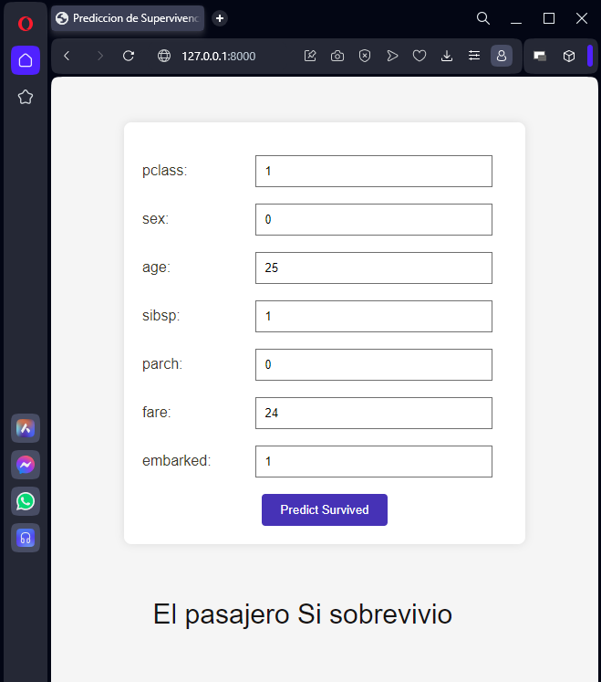

# Predicción de Supervivencia en el Titanic con Django

Este proyecto Django utiliza un modelo K-Nearest Neighbors (KNN) entrenado para predecir la supervivencia de los pasajeros a bordo del Titanic.

## Contenido del Repositorio

### Archivos del Código Fuente
- `Titanic_Knn_Predict_Survival.pkl`: Modelo entrenado pkl que contiene el análisis de datos, la selección del modelo y el entrenamiento del modelo KNN. 
- `manage.py`: Script de Django para gestionar la aplicación.

### App  `titanic_app`
- `models.py`: Define el modelo de datos de la aplicación Django.
- `views.py`: Contiene las vistas de la aplicación, incluida la vista que utiliza el modelo KNN para realizar predicciones.
- `urls.py`: Gestiona las URL de la aplicación.

### Archivos de Configuración
- `requirements.txt`: Lista de dependencias y versiones de Python necesarias para ejecutar el código.
- `environment.yml`: Archivo de entorno con las dependencias para crear un entorno de Conda.
 

### Otros Archivos
- `README.md`: Este archivo que proporciona información general sobre el proyecto.

## Instrucciones de Uso

1. Instalar las dependencias necesarias ejecutando `pip install -r requirements.txt` o creando un entorno de Conda con `conda env create -f environment.yml`.
2. Ejecutar `python manage.py runserver` para iniciar el servidor Django.
3. Acceder a `http://localhost:8000` en el navegador para utilizar la interfaz web y realizar predicciones.

## Notas Adicionales

- La aplicación Django utiliza un modelo KNN previamente entrenado para realizar predicciones de supervivencia en el Titanic.
- Asegúrese de tener instaladas las bibliotecas mencionadas en `requirements.txt` antes de ejecutar el código.

Este proyecto ofrece una solución integral para la predicción de supervivencia en el Titanic mediante una aplicación web desarrollada con Django.
